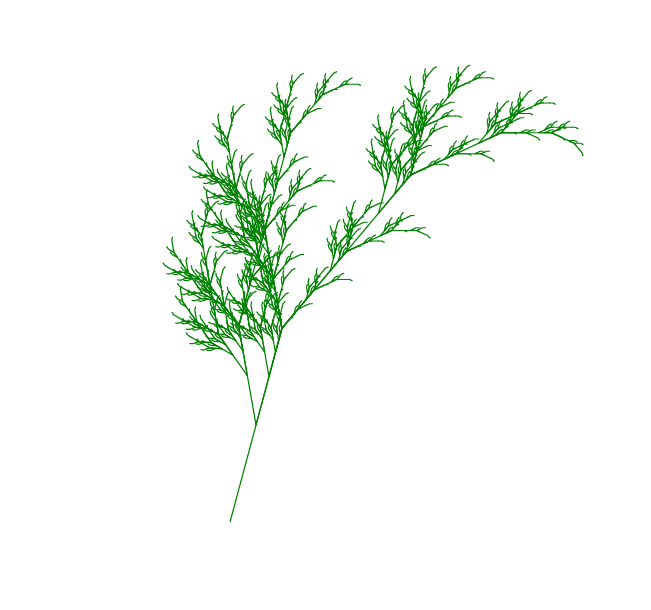

lsystem
=======

A Python module for L-systems

Example use:

    >>> from lsystem import LSystem

    >>> algae = LSystem(axiom='a', rules={'a':'ab', 'b':'a'})
    >>> print algae[5]
    abaababaabaab

Another example is given as a script `example-plant.py`.
Running the script 

    python example-plant.py

results in the following picture: 
